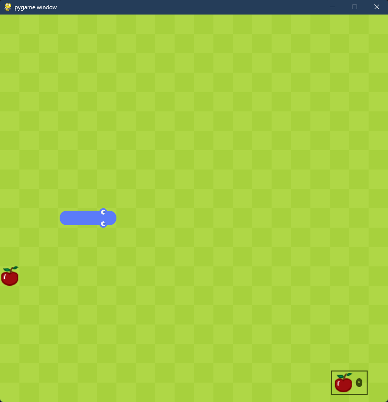

# Snake

Snake is a classic game in which you play as a snake and try to eat apples while avoiding hitting your own tail or the wall. The objective of the game is to grow longer, you grow by 1 block for each apple you eat.

## Installation

To be able to play the game, you need to download the __pygame__ library.

## Controls

The snake is controlled by 4 keys. Each key changes the direction of the snake.
- **Up arrow** : Move upwards (North)
- **Down arrow** : Move downwards (South)
- **Left arrow** : Move leftwards (West)
- **Right arrow** : Move rightwards (East)

## Gameplay

Guide the snake through the grass checkboard without hitting the snake's body or walls. If you eat an apple, your snake will grow longer by 1 block. You can see your score in the bottom right corner. If you hit the wall or the snake's body you will get to see the game over screen.

## Start the game

To start the game just run mainGame.py file. The application will open and you will see the snake standing still. To begin your run just press any of the arrow keys and play.

## Restart/close the game

From the game over screen you can just press any arrow key to restart the game or if you click
the close button, the application exits.

